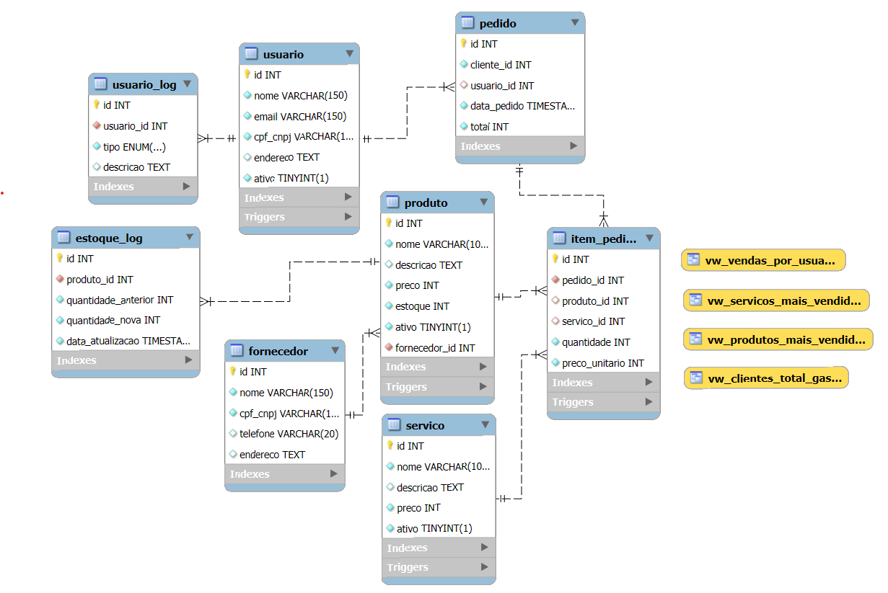

# TECHPOINT \- DATABASE

## Guilherme Brogio 166473-2024 / Trabalho de Gerenciamento de Banco de Dados

## **1\. Introdução**

Este relatório apresenta a modelagem conceitual e lógica do sistema de gerenciamento de vendas “TechPoint”, implementado em MySQL 8+. São descritas as entidades, seus atributos principais, relacionamentos, cardinalidades e o grau de normalização aplicado ao projeto. O objetivo é fornecer uma visão estruturada da organização dos dados para suportar as regras de negócio, garantindo integridade, flexibilidade e facilidade de manutenção.

---

## **2\. Entidades e Atributos**

A seguir, cada tabela (entidade) do banco de dados é detalhada em termos de atributos, chaves primárias, chaves estrangeiras e restrições (constraints).

### **2.1. Entidade Cliente**

* **Tabela**: `cliente`

* **Descrição**: Representa pessoas físicas que fazem compras.

* **Atributos**:

  * `id` (INT, PK, AUTO\_INCREMENT): Identificador único do cliente.

  * `nome` (VARCHAR(150), NOT NULL): Nome completo do cliente.

  * `cpf` (CHAR(11), NOT NULL, UNIQUE): CPF (11 dígitos, sem pontuação), único e validado via função.

  * `email` (VARCHAR(150), NOT NULL, UNIQUE): Endereço de e-mail do cliente.

  * `telefone` (VARCHAR(20), NULL): Telefone de contato.

  * `endereco` (TEXT, NULL): Endereço completo (rua, cidade, estado, etc.).

  * `ativo` (BOOLEAN, NOT NULL, DEFAULT TRUE): Indica se o cliente está ativo (pode fazer pedidos).

### **2.2. Entidade Usuário**

* **Tabela**: `usuario`

* **Descrição**: Representa operadores internos do sistema (funcionários, administradores).

* **Atributos**:

  * `id` (INT, PK, AUTO\_INCREMENT): Identificador único do usuário.

  * `nome` (VARCHAR(150), NOT NULL): Nome completo do usuário.

  * `email` (VARCHAR(150), NOT NULL, UNIQUE): E-mail de login e contato.

  * `cpf_cnpj` (VARCHAR(14), NOT NULL, UNIQUE): CPF (11 dígitos) ou CNPJ (14 dígitos), validado via funções.

  * `endereco` (TEXT, NULL): Endereço completo do usuário.

  * `ativo` (BOOLEAN, NOT NULL, DEFAULT TRUE): Indica se o usuário está ativo no sistema.

### **2.3. Entidade Usuário\_Log**

* **Tabela**: `usuario_log`

* **Descrição**: Armazena registros de alterações feitas por/para usuários, produtos e serviços.

* **Atributos**:

  * `id` (INT, PK, AUTO\_INCREMENT): Identificador único do log.

  * `usuario_id` (INT, NOT NULL, FK → `usuario(id)`): Usuário relacionado ao log.

  * `tipo` (ENUM, NOT NULL): Tipo de operação, podendo ser:

    * `deleta_produto`

    * `deleta_servico`

    * `atualizacao_perfil`

    * `atualizacao_produto`

    * `atualizacao_servico`

  * `descricao` (TEXT, NULL): Detalhes em CSV (antes/depois) do registro alterado.

### **2.4. Entidade Produto**

* **Tabela**: `produto`

* **Descrição**: Lista de produtos físicos disponíveis para venda.

* **Atributos**:

  * `id` (INT, PK, AUTO\_INCREMENT): Identificador único do produto.

  * `nome` (VARCHAR(100), NOT NULL): Nome do produto.

  * `descricao` (TEXT, NULL): Descrição detalhada do produto.

  * `preco` (INT, NOT NULL, CHECK(preco \>= 0)): Preço unitário em centavos (ex.: 350000 \= R$ 3.500,00).

  * `estoque` (INT, NOT NULL, DEFAULT 0, CHECK(estoque \>= 0)): Quantidade disponível em estoque.

  * `ativo` (BOOLEAN, NOT NULL, DEFAULT TRUE): Indica se o produto está ativo para venda.

  * `fornecedor_id` (INT, FK → fornecedor(id), NULL): identifica o fornecedor do produto. Pode ser nulo se ainda não atribuído.

### **2.5. Entidade Serviço**

* **Tabela**: `servico`

* **Descrição**: Lista de serviços (não físicos) que podem ser prestados ao cliente.

* **Atributos**:

  * `id` (INT, PK, AUTO\_INCREMENT): Identificador único do serviço.

  * `nome` (VARCHAR(100), NOT NULL): Nome do serviço.

  * `descricao` (TEXT, NULL): Descrição do que envolve o serviço.

  * `preco` (INT, NOT NULL, CHECK(preco \>= 0)): Preço do serviço em centavos.

  * `ativo` (BOOLEAN, NOT NULL, DEFAULT TRUE): Indica se o serviço está disponível.

### **2.6. Entidade Fornecedor**

* **Tabela**: `fornecedor`

* **Descrição**: Registra fornecedores de produtos (pessoas jurídicas ou físicas).

* **Atributos**:

  * `id` (INT, PK, AUTO\_INCREMENT): Identificador único do fornecedor.

  * `nome` (VARCHAR(150), NOT NULL): Nome ou razão social do fornecedor.

  * `cpf_cnpj` (VARCHAR(14), NOT NULL, UNIQUE): CPF (11 dígitos) ou CNPJ (14 dígitos), validado via função.

  * `telefone` (VARCHAR(20), NULL): Telefone de contato.

  * `endereco` (TEXT, NULL): Endereço do fornecedor.

### **2.7. Entidade Pedido**

* **Tabela**: `pedido`

* **Descrição**: Representa uma venda realizada, contendo referência ao cliente e ao usuário que atendeu.

* **Atributos**:

  * `id` (INT, PK, AUTO\_INCREMENT): Identificador único do pedido.

  * `cliente_id` (INT, NOT NULL, FK → `cliente(id)`): Cliente que efetuou o pedido.

  * `usuario_id` (INT, NULL, FK → `usuario(id)`): Usuário que registrou o pedido (opcional).

  * `data_pedido` (TIMESTAMP, NOT NULL, DEFAULT CURRENT\_TIMESTAMP): Data e hora de criação do pedido.

  * `total` (INT, NOT NULL, CHECK(total \>= 0)): Soma dos itens (produtos e serviços) em centavos.

### **2.8. Entidade Item\_Pedido**

* **Tabela**: `item_pedido`

* **Descrição**: Detalhamento de cada produto ou serviço incluído em um pedido.

* **Atributos**:

  * `id` (INT, PK, AUTO\_INCREMENT): Identificador do item do pedido.

  * `pedido_id` (INT, NOT NULL, FK → `pedido(id)`, ON DELETE CASCADE): Pedido ao qual o item pertence.

  * `produto_id` (INT, NULL, FK → `produto(id)`): Referência a um produto (quando aplicável).

  * `servico_id` (INT, NULL, FK → `servico(id)`): Referência a um serviço (quando aplicável).

  * `quantidade` (INT, NOT NULL, CHECK(quantidade \> 0)): Quantidade de itens (unidades ou sessões).

  * `preco_unitario` (INT, NOT NULL, CHECK(preco\_unitario \>= 0)): Preço unitário em centavos, no momento da venda.

  * **Constraint**: `chk_item_produto_servico` — garante que exatamente um entre `produto_id` ou `servico_id` seja não-nulo (não pode incluir item de produto e serviço simultaneamente).

### **2.9. Entidade Estoque\_Log**

* **Tabela**: `estoque_log`

* **Descrição**: Registra histórico de alterações de estoque de produtos.

* **Atributos**:

  * `id` (INT, PK, AUTO\_INCREMENT): Identificador do log de estoque.

  * `produto_id` (INT, NOT NULL, FK → `produto(id)`): Produto cujo estoque foi alterado.

  * `quantidade_anterior` (INT, NOT NULL): Quantidade em estoque antes da atualização.

  * `quantidade_nova` (INT, NOT NULL): Quantidade após a atualização.

  * `data_atualizacao` (TIMESTAMP, NOT NULL, DEFAULT CURRENT\_TIMESTAMP): Data e hora em que foi feita a alteração.

---

## **3\. Relacionamentos e Cardinalidades**

A seguir, descrevemos como as entidades se conectam, explicitando cardinalidades (1:1, 1:N, N:M, quando aplicável), além de restrições de integridade referencial definidas por chaves estrangeiras.

1. **Cliente → Pedido (1:N)**

   * Cada **cliente** pode ter **zero ou muitos pedidos**.

   * A chave estrangeira `pedido.cliente_id` referencia `cliente(id)`.

   * Cardinalidade:

     * **Cliente (1)** —\< **Pedido (N)**.

   * **Regra de negócio**: cliente só pode ser excluído logicamente (campo `ativo = false`), preservando histórico de pedidos.

2. **Usuário → Pedido (1:N)**

   * Cada **usuário** (operador) pode registrar **zero ou muitos pedidos**.

   * A chave estrangeira `pedido.usuario_id` referencia `usuario(id)`.

   * Cardinalidade:

     * **Usuário (1)** —\< **Pedido (N)**.

   * O campo `usuario_id` em `pedido` pode ser nulo caso o pedido seja originado sem operador associado.

3. **Pedido → Item\_Pedido (1:N)**

   * Cada **pedido** deve ter **um ou mais itens** (produto/serviço).

   * A chave estrangeira `item_pedido.pedido_id` referencia `pedido(id)`.

   * Cardinalidade:

     * **Pedido (1)** —\< **Item\_Pedido (N)**.

   * **Regra de integridade**: ON DELETE CASCADE em `item_pedido.pedido_id`, para que, ao excluir um pedido, seus itens sejam eliminados automaticamente.

4. **Produto → Item\_Pedido (1:N)**

   * Cada **produto** pode aparecer em **zero ou muitos itens de pedido** (quando vendido).

   * A chave estrangeira `item_pedido.produto_id` referencia `produto(id)`.

   * Cardinalidade:

     * **Produto (1)** —\< **Item\_Pedido (N)**.

   * **Regra de integridade**: se um produto for removido, não há restrição de cascade; é recomendável desativar (`ativo = false`) em vez de excluir fisicamente.

5. **Serviço → Item\_Pedido (1:N)**

   * Cada **serviço** pode aparecer em **zero ou muitos itens de pedido** (quando prestado).

   * A chave estrangeira `item_pedido.servico_id` referencia `servico(id)`.

   * Cardinalidade:

     * **Serviço (1)** —\< **Item\_Pedido (N)**.

   * Assim como em produtos, serviços não são apagados; somente desativados.

6. **Produto → Estoque\_Log (1:N)**

   * Cada **produto** possui **zero ou muitos registros de log** de atualização de estoque.

   * A chave estrangeira `estoque_log.produto_id` referencia `produto(id)`.

   * Cardinalidade:

     * **Produto (1)** —\< **Estoque\_Log (N)**.

   * **Regra**: a trigger ou procedure de atualização de estoque insere automaticamente um registro em `estoque_log` sempre que o estoque de um produto é alterado.

7. **Usuário → Usuário\_Log (1:N)**

   * Cada **usuário** (autor da ação) pode ter **zero ou muitos logs**.

   * A chave estrangeira `usuario_log.usuario_id` referencia `usuario(id)`.

   * Cardinalidade:

     * **Usuário (1)** —\< **Usuário\_Log (N)**.

   * Exemplifica ações de atualização de perfil, exclusão de produto/serviço ou atualização de produto/serviço.

   #### **8\. Fornecedor → Produto (1:N)**

   * Descrição: Cada fornecedor pode fornecer zero ou muitos produtos.

   * Chave estrangeira: `produto.fornecedor_id` referencia `fornecedor.id`.

   * Cardinalidade:

     * **Fornecedor (1)** —\< **Produto (N)**.

   * Observação: A associação permite rastrear a origem de cada item do estoque e gerar relatórios por fornecedor.

---

## **4\. Diagrama Entidade-Relacionamento (ERD)**

---

## **5\. Observações Finais**

1. **Validação de CPF/CNPJ**:

   * Implementadas via funções `valida_cpf(p_cpf)` e `valida_cnpj(cnpj)` para garantir que somente números válidos sejam inseridos nos campos `cpf`, `cpf_cnpj` ou `cnpj`.

2. **Estratégia de Exclusão**:

   * Para tabelas sensíveis (cliente, usuário, produto, serviço), utiliza-se o atributo `ativo` para inativação lógica, permitindo histórico completo nos **logs**.

3. **Views para Relatórios**:

   * Visões como `vw_servicos_mais_vendidos`, `vw_produtos_mais_vendidos`, `vw_vendas_por_usuario` e `vw_clientes_total_gasto` foram criadas para facilitar consultas analíticas.
